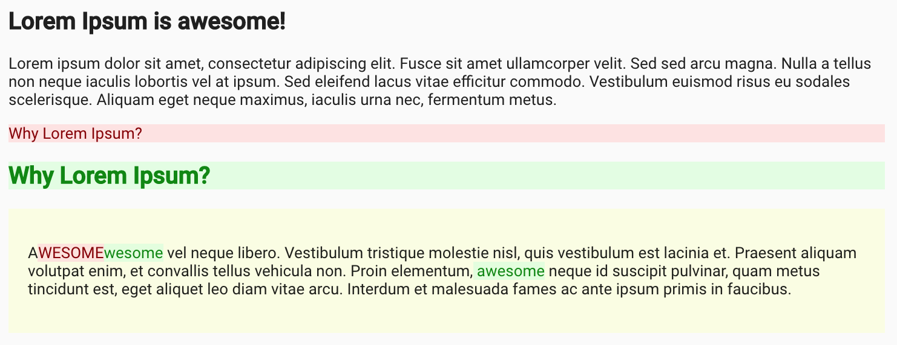

# array-diff-items [](https://circleci.com/gh/jooohn/array-diff-items)

A JavaScript module that finds the most ideal path to change an array to another array.



### Demo

https://array-diff-items-example.netlify.com/

### Motivations

Most diff detecting library detects "Added", "Removed", "Unchanged" operations.

```
['Orange', 'Apple',  'Banana']
['Grape',  'Apples', 'Banana']

=>

Removed: Orange
Removed: Apple
Added: Grape
Added: Apples
Unchanged: Banana
```

Such diff detection might be sufficient in many cases, but sometimes we want to detect "Change" rather than "Remove" then "Add".

```
['Orange', 'Apple',  'Banana']
['Grape',  'Apples', 'Banana']

=>

Removed: Orange
Added: Grape
Changed: Apple => Apples
Removed: Banana
Added: Melon
```

`array-diff-items` solves this problem by introducing "cost" to change. It prefers "Change" when its cost to change `a` to `b` is less than simply removing `a` and adding `b`.

### Installation

```
yarn add array-diff-items
```

### Getting Started

```js
import arrayDiffItems from 'array-diff-items';

// type Compare<T> = (left: T, right: T) => number;
// arrayDiffElements: <T>(left: T[], right: T[]) => (compare: Compare<T>) => DiffItem<T>[];
```

```js
const left  = ['Banana', 'Apple', 'Orange',          'Grape'];
const right = [          'Apple', 'Orange', 'Melon', 'Grape Fruit'];

arrayDiffItems(left, right)((a, b) => {
  // Return the cost to change "a" to "b".
  // When cost is less than 1, that means changing "a" to "b" is preferable to removing "a" and then adding "a".
  if (a === b) return 0;
  if (a.startsWith(b) || b.startsWith(a)) return 0.5;
  return 2;
});
// [
//   {"type":"Removed","item":"Banana"},
//   {"type":"Unchanged","item":"Apple"},
//   {"type":"Unchanged","item":"Orange"},
//   {"type":"Added","item":"Melon"},
//   {"type":"Changed","left":"Grape","right":"Grape Fruit"}
// ]
```
